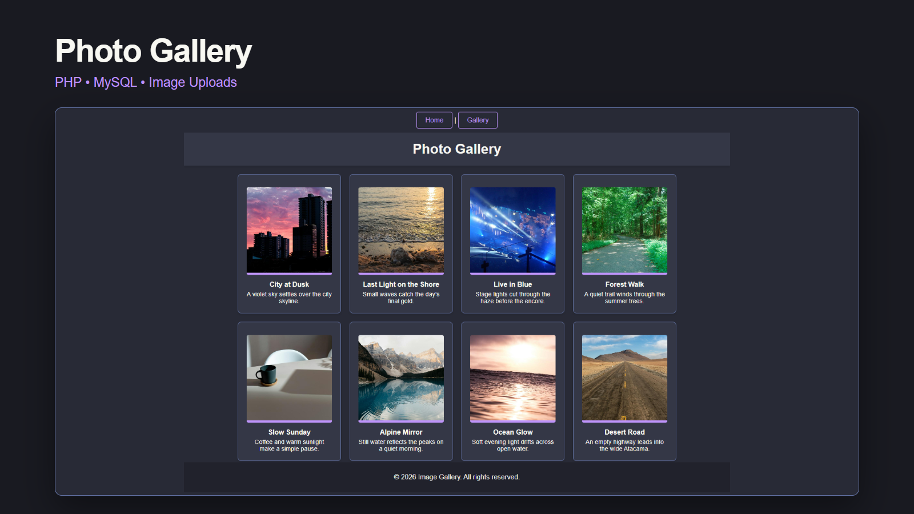

# Photo Gallery

A PHP and MySQL web application I built to practice image uploads, database integration, image processing, and displaying stored images in a gallery.



## Features

- Upload images with a title and description
- Store image information in MySQL
- Resize uploaded images for gallery display
- Display uploaded images in a responsive gallery
- Basic file validation and image processing

## Tech Stack

- PHP
- MySQL
- HTML
- CSS
- PDO

## Demo

[▶ Watch the demo](docs/media/photo-gallery-demo.mp4)

## Running Locally

### Requirements

- PHP 8.4
- MySQL or MariaDB
- PHP extensions: `fileinfo`, `gd`, and `pdo_mysql`

Import `sql/gallery.sql` to create the `photo_gallery` database and `images` table.

Create the `photo_gallery_app` database user with `SELECT` and `INSERT` access to the database.

For security, the database password is not stored in the repository. It must be provided through the `PHOTO_GALLERY_DB_PASSWORD` environment variable.

On the configured Windows machine, start the application from the project directory:

```powershell
$securePassword = Import-Clixml (Join-Path $env:APPDATA 'PhotoGallery\app-password.clixml')
$env:PHOTO_GALLERY_DB_PASSWORD = [System.Net.NetworkCredential]::new('', $securePassword).Password
php -S 127.0.0.1:8000 -t .
```

Then open:

`http://127.0.0.1:8000/`

The `uploads` and `resized` directories must be writable for image uploads.

## About

This is an older learning project I built while practicing PHP and MySQL, later updated for standalone local execution and portfolio presentation.
